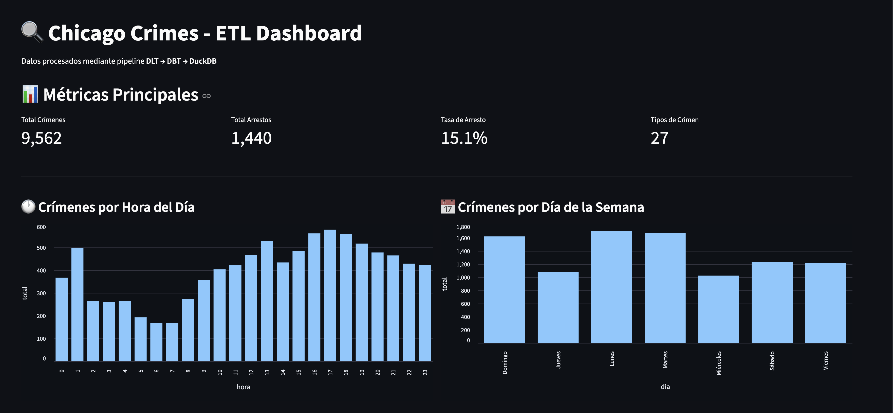

# Chicago Crimes ETL Pipeline

Pipeline ETL completo para el análisis de crímenes reportados en la ciudad de Chicago, implementado con tecnologías estándar de la industria de Data Engineering.

---

## Dataset

**Nombre:** Crimes - 2001 to Present  
**Fuente:** [City of Chicago Open Data Portal](https://data.cityofchicago.org/resource/ijzp-q8t2.json)  
**Formato:** JSON (REST API)  
**Actualización:** Continua  

El dataset contiene crímenes reportados en Chicago desde 2001 hasta el presente. Incluye información sobre tipo de crimen, ubicación, fecha, si hubo arresto y más.

### Campos Principales

| Campo | Descripción |
|-------|-------------|
| `id` | Identificador único del crimen |
| `case_number` | Número de caso |
| `date` | Fecha y hora del crimen |
| `primary_type` | Tipo principal (THEFT, BATTERY, etc.) |
| `description` | Descripción detallada |
| `location_description` | Lugar del crimen |
| `arrest` | Si hubo arresto (booleano) |
| `domestic` | Si fue incidente doméstico |
| `latitude` / `longitude` | Coordenadas geográficas |
| `district` / `ward` / `beat` | Divisiones policiales |

---

## Instalación

### 1. Crear entorno virtual

```bash
cd "M11. W02 - Proyecto Final"
python -m venv venv
source venv/bin/activate  # macOS/Linux
```

### 2. Instalar dependencias

```bash
pip install -r requirements.txt
```

---

## Ejecución

### Pipeline completo (Ingesta + Transformación)

Por defecto, la ingesta comienza el **1 de enero del año actual** y la transformación se ejecuta en el schema **blue** (Write + Audit).

```bash
python orchestrator.py
```

### Pipeline completo con publicación WAP (blue → green)

Para que el dashboard funcione, es necesario publicar los datos del schema blue al green:

```bash
python orchestrator.py --publish
```

### Especificar fecha de inicio

Usa `--start-date` para controlar desde qué fecha se inician la carga de datos. Si no se indica, el valor por defecto es el 1 de enero del año en curso.

```bash
# Cargar desde una fecha concreta
python orchestrator.py --start-date 2026-03-01
  
# Resetear estado incremental y recargar desde la fecha indicada
python orchestrator.py --start-date 2026-03-01 --reset-state
```

> **Nota sobre incrementalidad:** En ejecuciones posteriores a la primera, el pipeline retoma automáticamente desde el último registro procesado (cursor incremental DLT). Usa `--reset-state` para ignorar ese estado y forzar la recarga desde `--start-date`.

### Solo transformación con publicación

```bash
python orchestrator.py --skip-ingestion --publish
```

### Solo ingesta

```bash
python orchestrator.py --skip-transformation
```
  
### Iniciar el Dashboard

> **Nota:** El dashboard lee del schema `analytics_green`. Es necesario ejecutar al menos una vez con `--publish` para que existan datos.

```bash
streamlit run 03.dashboard/app.py
```

---

## Pipeline de Ingesta (DLT)

El pipeline de ingesta utiliza **DLT (Data Load Tool)** para:

1. **Extraer** datos de la API de Chicago Open Data con paginación (`$limit` + `$offset`)
2. **Carga incremental** basada en el campo `date` - solo se cargan registros nuevos en cada ejecución
3. **Merge strategy** con `primary_key="id"` para evitar duplicados
4. **Almacenar** en DuckDB en el schema `raw_crimes`, tabla `crimes`

### Parámetros de fecha

| `--start-date` | Fecha de inicio de la ingesta (`YYYY-MM-DD`)  
| `--reset-state` | Elimina el cursor incremental guardado y recarga desde `--start-date`  

---

## Pipeline de Transformación (DBT)

El pipeline de transformación sigue una arquitectura medallion con estrategia **WAP (Write-Audit-Publish)** usando **Blue/Green deployment**:

### Estrategia WAP Blue/Green

-  **Write** | `dbt run --target blue` 
-  **Audit** | `dbt test --target blue` 
-  **Publish** | `dbt run-operation publish --target green` 


- **Blue** (`analytics_blue`): Schema de escritura donde se ejecutan todos los modelos y tests de calidad.
- **Green** (`analytics_green`): Schema de producción donde el dashboard lee datos validados.
- La publicación solo copia las tablas del datamart (no las vistas intermedias).

### Capas de Modelos

-  **Source** | `src_chicago_crimes` | Vista sobre datos crudos de DLT
-  **Staging** | `stg_chicago_crimes` | Tipado y selección de columnas
-  **Cleaning** | `cleaned_chicago_crimes` | Eliminación de nulos, duplicados y coordenadas inválidas
-  **Enrichment** | `enriched_chicago_crimes` | Campos derivados: hora, día, período, fin de semana
-  **Structural** | `stg_fact_chicago_crimes` | Modelo pre-fact con campos finales
-  **Datamart** | `fact_chicago_crimes` | Tabla de hechos materializada
-  **Datamart** | `dim_crime_type` | Dimensión de tipos de crimen
-  **Datamart** | `dim_location` | Dimensión de ubicaciones
-  **Datamart** | `dim_date` | Dimensión de calendario

---

## Dashboard (Streamlit)



El dashboard muestra:

- **KPIs**: Total crímenes, arrestos, tasa de arresto, tipos de crimen 
- **Distribución por hora** del día
- **Distribución por día** de la semana
- **Análisis de arrestos** vs no arrestos 
- **Top 10 ubicaciones** con más crímenes

---